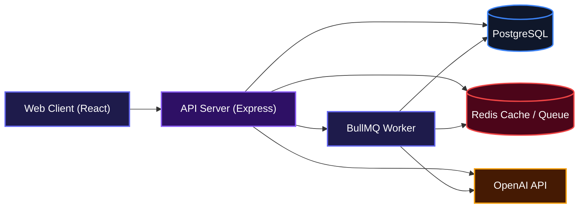

## HOW I INTERPRETED THE BRIEF

I interpreted the brief as building a small reliable health-information companion rather than a general-purpose medical chatbot.

### WHAT I CHOSE TO BUILD

1. A client to view published health articles/FAQs/tips from the supplied dataset.
2. Support within the client for viewing English and Nigerian Pidgin articles/FAQs/tips with English fallback where no equivalent Nigerian Pidgin record is found.
3. Contextual AI questions about specific articles/FAQs/tips.
4. General health question chat.
5. Backend API between the frontend, database and OpenAI.

### WHAT I CHOSE NOT TO BUILD

1. An admin user-interface.
2. Authentication/accounts.
3. Medical diagnosis.
4. A full CMS.

I chose not to build these because I prioritised the core user functions, and deployment over additional features. The brief specifically says a small fully working application is preferable to an ambitious unfinished one.

## HOW I STORED CONTENT AND TRANSLATIONS

After going through the supplied dataset, I came up with this data model: 
```text
                         ┌────────────────────┐
                         │      authors       │
                         ├────────────────────┤
                         │ id                 │
                         │ name               │
                         │ created_at         │
                         │ updated_at         │
                         └─────────┬──────────┘
                                   │
                                  1│
                                   │N
                         ┌─────────▼──────────┐
                         │      articles      │
                         ├────────────────────┤
                         │ id                 │
                         │ content_type       │
                         │ topic              │
                         │ author_id          │
                         │ status             │
                         │ created_at         │
                         │ updated_at         │
                         └─────────┬──────────┘
                                   │
                                  1│
                                   │N
                         ┌─────────▼──────────┐
                         │    translations    │
                         ├────────────────────┤
                         │ id                 │
                         │ article_id         │
                         │ language_id        │
                         │ title              │
                         │ summary            │
                         │ body               │
                         │ created_at         │
                         │ updated_at         │
                         └──────┬─────────┬───┘
                                │         │
                               N│         │1
                                │         │
                     ┌──────────▼───┐ ┌───▼────────────┐
                     │    chunks    │ │    languages   │
                     ├──────────────┤ ├────────────────┤
                     │ id           │ │ id             │
                     │ translation_id││ code           │
                     │ content      │ │ name           │
                     │ chunk_index  │ │ created_at     │
                     │ embedding    │ └────────────────┘
                     │ created_at   │
                     └──────────────┘
```
I made the following decisions:
1. I used PostgreSQL as the runtime content store.
2. I made an Authors table, with a one to many relationship to articles; this allows for new authors without schema changes.
3. I gave Translations a separate table; this allows for new languages without schema changes.
4. I made a Language table instead of implementing an application-level enum; this allows for new languages without schema changes.
5. I kept a single name field in Authors because the source data contained names specifically with prefixes and middle names, therefore trying to infer structured first/last names from these will lead to inconsistent and potentially incorrect data.
6. Titles are not globally unique, however (article_id, language_id) is unique in translations.
7. Dates are normalized during ingestion to PostgreSQL timestamptz.
8. User-facing content is not globally lowercased, although this normalization applies to fields used for matching, categorization and lookup.
9. Draft content is excluded from the published AI knowledge base.
10. CSV ingestion is handled by a repeatable import/cleaning pipeline, rather than manually transforming the supplied data.
11. Chunking and vector embeddings are asynchronous, so publishing content does not make the request itself wait on AI/vector processing.

## HOW I HANDLED THE SUPPLIED DATA

For the supplied data, I first established normalization rules in line with the database model. I then created a one-time ingestion script to normalize and ingest the supplied dataset into the database.  

I kept ingestion as an explicit, deterministic pipeline with pure normalization functions separated from database writes. That makes messy-data decisions testable, keeps the database layer simple, and provides a clean place to document exactly how the supplied content was transformed.

> Future data will be inserted through dedicated client-side forms backed by API endpoints, with validation enforced at both the frontend and backend layers to ensure all submissions conform to the established database schemas. The primary interface will be designed for non-technical users and will not require direct database interaction. 

### NORMALIZATION RULES
| Field         | Rule                                                                 |
| ------------- | -------------------------------------------------------------------- |
| `title`       | trim, decode HTML entities, strip HTML, collapse whitespace          |
| `summary`     | same; preserve `null` when absent                                    |
| `body`        | strip HTML, decode entities, collapse whitespace                     |
| `topic`       | lowercase → canonical topic mapping                                  |
| `status`      | `draft` → draft; `published`, `Published`, `TRUE`, `yes` → published |
| `date`        | parse supported formats; missing → `createdAt`/`updatedAt` fallback  |
| `author`      | trim; missing → `"Unknown"`                                          |
| `contentType` | `article` because the source has no content-type field               |
| language      | English = `en`; Pidgin = `pcm`                                       |
| empty strings | treated as null where the database permits it                        |

### DEDUPLICATION RULES
1. Topic canonicalization is explicit
2. Exact normalized title + body → duplicate.
3. Very high combined title/body similarity → near-duplicate.
4. Near-duplicates are merged only when the content is substantively the same.
5. Same topic or similar subject alone never causes merging.
6. When merging, retain the first/source-earliest row as canonical and log the duplicate source IDs.
7. A re-run must not create another copy.

## MY ARCHITECTURE

**Web Client (Frontend)**: displays published content and handles chat interaction.  
**API server (Backend)**: owns business logic, content retrieval, and AI requests. API keys are stored here as well.  
**PostgreSQL**: persistent source of published articles/translations.  
**OpenAI**: generates responses using retrieved published content.  
**BullMQ + Redis**: Task-queue system.

#### WEB CLIENT 
```text
              Health Information Companion
                           │
       ┌────────────────────────────────────────┐
       │                                        │
Browse Content                             Ask a Question
       │                                        │       
Articles/FAQs/Tips                         General Chat
       │
"Ask about this..."
       │
Contextual AI Chat

```

### KEY DECISIONS AND TRADE OFFS

1. PostgreSQL instead of storing the CSV directly

I chose PostgreSQL as the data store because the application needs a relational structure between articles and their translations, and the schema needs to support adding future languages without requiring structural changes.   

**The trade-off** was the additional complexity of setting up and querying a database compared with simply reading the CSV, but this gives the application a proper persistent data model and makes future extensions much easier.

2. Frontend language fallback

I chose to handle language fallback on the frontend because the application is relatively lightweight, while the backend already filters translations server-side using an `INNER JOIN`. This means articles without a translation in the requested language are naturally excluded from the backend response. To provide a graceful English fallback, the frontend fetches both the selected language and English, then merges the results with the selected-language translation taking priority. 

**The trade-off** was adding client-side merging logic, but it keeps the backend endpoint simple while still providing a decent user experience.

3. One-time ingestion instead of building an admin UI

I chose to make the initial CSV ingestion a one-time process because the brief explicitly states that an admin UI is optional and prioritises the core application. 

**The trade-off** was that new content cannot be added through the application interface (for now), but this allowed me to focus the implementation effort on the required article retrieval, translation, filtering, and fallback functionality rather than introducing an additional CRUD interface that wasn't necessary for the core requirements

## HOW I USED AI TO BUILD THIS

I used AI as a development assistant for scaffolding, debugging, implementation suggestions and reviewing approaches, while remaining responsible for the architecture, integration and validation.

I first worked through the brief myself to understand the requirements, define the intended scope and identify the decisions I needed to make. I then used a project-scoped ChatGPT workspace containing the brief, supplied datasets and project context, with separate conversations for activities such as ideation, architecture and implementation/debugging.

I manually drove the key architectural decisions. For example, I worked out the data model, ingestion and normalisation approach, backend APIs and project structure, then used AI to challenge or review these decisions. I fact-checked important outputs against the brief, supplied data and the behaviour of the application.

For implementation, I broke larger tasks into smaller, testable pieces. For the frontend in particular, I used AI to help develop a plan and divided the work into three distinct phases that could be implemented and tested independently.

#### WHAT DID AI GET WRONG

The AI initially failed to account for articles with an empty title columns in the normalization/ingestion logic. Since I designed article's title as a NOT NULL field in the database, I handled this during by assigning placeholder titles rather than discarding the content. During API retrieval, content with placeholder titles are then excluded from normal results, while an update endpoint allows the title to be corrected later. This means the incomplete record is preserved in the database instead of being permanently lost, while ensuring incomplete content is not presented to users. 

## WHAT I WOULD DO NEXT WITH ANOTHER WEEK

With another week, I would focus on making the system more production-ready rather than expanding the feature set. I would implement:   
1. Usage and audit logging: to track important application and AI events to make the system easier to monitor, debug and audit.  
2. Server-side caching: caching frequently requested content and suitable AI-related data to reduce database/API calls and improve response times.
3. Token and cost tracking: to track LLM token usage and associated costs so AI usage can be monitored and controlled as the application scales.
